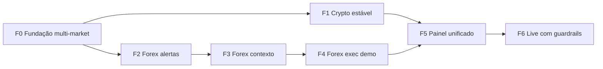

# Roadmap: Cripto + Forex no DIVAP Trader

> **Status:** Proposta estratégica — aguardando decisões de broker Forex e aprovação por fase.  
> **Data:** 2026-06-10  
> **Autor:** planejamento assistido (baseado no código em `main`)

---

## 1. Objetivo

Operar **cripto (Binance testnet → live)** e **Forex (demo → live)** com a **mesma metodologia DIVAP**, mas com:

- Venues e regras de risco **isoladas por mercado**
- Scanner e perfis **compartilhados** onde fizer sentido
- Execução **desacoplada** (cada mercado com seu broker)
- Painel único mostrando **dois livros** (crypto / forex) sem misturar PnL ou limites

**Não é objetivo:** replicar APTC/Bybit ou virar plataforma multi-broker genérica no curto prazo.

---

## 2. Estado atual (baseline)

| Área | Hoje | Gap para Forex |
|------|------|----------------|
| Dados OHLCV | `BinanceSource` (ccxt) | Sem fonte FX |
| Execução | `BinanceBroker` spot USDT | Sem ordens FX |
| Scanner DIVAP | Agnóstico a candles | OK — reutilizável |
| Perfis YAML | `symbols` crypto fixos | Sem `market` / sessão FX |
| Contexto | Fear&Greed, crypto news | Sem calendário econômico / sessões |
| Trades DB | `symbol`, `pnl_usdt` | Sem `market`, `venue`, pip/lot |
| Readiness | Valida só Binance | Precisa validar FX broker |
| Dashboard | Badge testnet crypto | Precisa abas/filtro por mercado |

**Ponto forte:** `ExchangeSource` já existe (`src/data/sources/interfaces.py`).  
**Ponto fraco:** `TradeExecutor` e `PositionMonitor` acoplados a `BinanceBroker` / `BinanceSource`.

---

## 3. Princípios de arquitetura (fazer certo)

### 3.1 Identidade de instrumento

Todo sinal/trade passa a carregar:

```text
market:  crypto | forex
venue:   binance | oanda   (extensível)
symbol:  BTCUSDT | EUR_USD  (normalizado por venue)
```

Normalização interna via `Instrument` (dataclass) — **nunca** comparar `BTCUSDT` com `EUR/USD` como string solta.

### 3.2 Duas interfaces, espelhando o que já existe

| Interface | Responsabilidade | Implementações |
|-----------|------------------|----------------|
| `MarketDataSource` | OHLCV, ticker | `BinanceSource`, `OandaSource` |
| `ExecutionBroker` | Saldo, ordem, posição | `BinanceBroker`, `OandaBroker` |

`TradeExecutor` recebe `(data_source, broker, market_config)` via factory — não instancia Binance direto.

### 3.3 Perfis por mercado

Cada perfil YAML ganha bloco opcional:

```yaml
market: crypto   # default crypto para retrocompat
venue: binance
scan:
  symbols: [...]
  sessions: []   # crypto = 24/7
execution:
  max_spread_pips: null   # crypto ignora
  allowed_sessions: []    # forex: london, new_york
```

Perfis **cross-market** (mesmo nome operando BTC e EUR) só na **Fase 5** — começar com perfis separados (`caixa_rapido_crypto`, `caixa_rapido_fx`).

### 3.4 Risco isolado

| Regra | Crypto | Forex |
|-------|--------|-------|
| Moeda de banca | USDT | USD (conta demo/live OANDA) |
| Tamanho posição | % banca USDT | % equity **ou** risco fixo em pips |
| Max trades abertos | Por perfil | Por perfil **e** por mercado |
| Stop | % / violinada | pips + spread buffer |
| Horário | 24/7 | Filtro de sessão + evitar rollover |

**Regra de ouro:** meta mensal / modo protegido **por mercado**, não global misturado.

### 3.5 Contexto de mercado

| Input | Crypto | Forex |
|-------|--------|-------|
| Sentimento | Fear & Greed | DXY, yields, risk-on/off |
| Notícias | CryptoPanic | Calendário econômico (ForexFactory / Investing API) |
| HTF trend | BTC dom, índices | Mesma lógica em H4/D1 do par |
| Gate extra | — | Spread atual vs média, notícia tier-1 ±30 min |

---

## 4. Escolha de broker Forex (decisão necessária)

| Opção | Prós | Contras | Recomendação |
|-------|------|---------|--------------|
| **OANDA v20 API** | REST madura, demo gratuita, pip/lot nativo | Conta BR depende de regulamentação do usuário | **MVP Forex** |
| Interactive Brokers | Profissional, multi-ativo | API complexa, onboarding pesado | Fase 2+ se escalar |
| Bridge MetaTrader 5 | Se você já opera XP/ corretora MT5 | Frágil, latência, infra extra | Só se MT5 for inegociável |
| ccxt forex | Unifica código | Poucos brokers FX confiáveis no ccxt | Não recomendado como base |

**Recomendação do plano:** OANDA practice account para Fases 2–4; revisitar IB se volume/live justificar.

---

## 5. Roadmap em fases



### Fase 0 — Fundação multi-market (≈ 1 semana)

**Objetivo:** refatorar sem mudar comportamento em produção.

- [ ] Criar `src/markets/` com `Instrument`, `Market`, `Venue` enums
- [ ] Renomear/clarificar `ExchangeSource` → `MarketDataSource`
- [ ] Introduzir `ExecutionBroker` ABC; `BinanceBroker` implementa
- [ ] Factory `get_data_source(instrument)` / `get_broker(venue)`
- [ ] Migration DB: `trades.market`, `trades.venue`, `alerts.market` (default `crypto`)
- [ ] Testes: comportamento Binance idêntico ao anterior

**Critério de pronto:** deploy crypto inalterado; CI verde.

---

### Fase 1 — Crypto estável (≈ 1 semana, paralelo à F0)

**Objetivo:** consolidar o que já está em prod antes de abrir segundo mercado.

- [ ] Documentar env Easypanel (`TRADING_*` no painel, não só `.env` manual)
- [ ] Métricas de scan/monitor por perfil no dashboard
- [ ] Push + Telegram validados com inscrição real
- [ ] 2 semanas de operação testnet com logs de gate (por que não entrou)

**Critério de pronto:** ≥ 10 trades testnet fechados com PnL rastreado; zero regressão.

---

### Fase 2 — Forex: dados + alertas (≈ 2–3 semanas)

**Objetivo:** ver sinais DIVAP em pares FX **sem executar ordens**.

- [ ] `OandaSource` — OHLCV M15/H1/H4/D1 para `EUR_USD`, `GBP_USD`, `USD_JPY`, `XAU_USD`
- [ ] Perfis YAML forex (`divap_fx`, `caixa_rapido_fx`) com símbolos e TFs
- [ ] Celery: scan forex em beat separado (não bloquear crypto)
- [ ] Alertas Telegram/Push prefixados `[FX]`
- [ ] Dashboard: filtro mercado + coluna mercado nas tabelas

**Critério de pronto:** alertas FX em demo igual qualidade visual aos crypto; nenhuma ordem enviada.

---

### Fase 3 — Forex: contexto e gates (≈ 2 semanas)

**Objetivo:** não operar FX em spread alto, notícia tier-1 ou fora de sessão.

- [ ] `ForexContextCollector` — sessão (Londres/NY), spread, ATR mínimo
- [ ] Integração calendário econômico (API ou scrape controlado com cache)
- [ ] Gates em `should_execute_trade`: `spread_too_wide`, `news_blackout`, `session_closed`
- [ ] LLM prompt ajustado para FX (não citar Fear&Greed como primário)

**Critério de pronto:** relatório readiness FX no painel; gates testados unitariamente.

---

### Fase 4 — Forex: execução demo OANDA (≈ 3 semanas)

**Objetivo:** trades FX automáticos em **conta practice**.

- [ ] `OandaBroker` — market/limit, SL/TP, fechamento, saldo USD
- [ ] `RiskManager` FX — sizing em unidades OANDA, min lot, margem
- [ ] `TradeExecutor` + `PositionMonitor` via factory (crypto vs forex)
- [ ] Exit policy FX (Fibo + time stop adaptado a pips)
- [ ] Readiness: chaves OANDA, practice account, margem livre

**Critério de pronto:** 20+ trades demo FX fechados; PnL USD separado no `/stats`.

---

### Fase 5 — Painel e banca unificados (≈ 2 semanas)

**Objetivo:** operar os dois mercados no mesmo painel, sem confusão.

- [ ] Abas ou toggle **Crypto | Forex | Todos**
- [ ] Banca: USDT (Binance) + USD (OANDA) side-by-side
- [ ] Meta mensal por mercado
- [ ] Scan status por mercado (beat, último scan, bloqueios)
- [ ] Export CSV / relatório semanal por mercado

**Critério de pronto:** você consegue responder em 10s “como está crypto vs forex hoje?”

---

### Fase 6 — Live com guardrails (contínuo)

**Objetivo:** dinheiro real só com trilhos.

| Mercado | Sequência sugerida |
|---------|-------------------|
| Crypto | testnet estável → live com `TRADING_MAX_OPEN_TRADES=1` → escala gradual |
| Forex | OANDA practice 30 dias → micro-lot live → escala por meta |

Checklist live (ambos):

- [ ] Kill switch env (`TRADING_ENABLED=false` por mercado)
- [ ] Alertas de drawdown diário
- [ ] Revisão semanal de gates bloqueados vs trades tomados
- [ ] ADR documentando broker e limites

---

## 6. Cronograma sugerido

| Semana | Foco | Entrega visível |
|--------|------|-----------------|
| 1 | F0 + F1 | Refatoração + crypto estável |
| 2–3 | F2 | Alertas FX no Telegram |
| 4 | F3 | Gates FX (sessão/spread/notícia) |
| 5–7 | F4 | Trades demo OANDA |
| 8 | F5 | Dashboard dual-market |
| 9+ | F6 | Go-live gradual |

**Total até operar Forex demo automatizado:** ~7 semanas.  
**Total até operar ambos com confiança no painel:** ~8 semanas.

---

## 7. Riscos e mitigação

| Risco | Impacto | Mitigação |
|-------|---------|-----------|
| Misturar PnL crypto/forex | Decisões erradas de risco | Colunas `market` + stats separados desde F0 |
| Forex em notícia NFP | Perdas rápidas | Blackout calendário F3 |
| Spread alargado | Stop prematuro | Gate spread + buffer em pips |
| Duplicar lógica Binance/OANDA | Bugs divergentes | Executor único + brokers plugáveis |
| OANDA indisponível BR | Bloqueio live | Validar conta antes F4; plano B IB |
| Scope creep (Bybit, ações…) | Atraso | ADR por novo venue; Forex antes de Bybit |

---

## 8. O que **não** fazer agora

1. **Não** adaptar EUR/USDT da Binance como “Forex” — é crypto, spreads e dinâmica diferentes.
2. **Não** executar FX antes de 2–4 semanas só com alertas manualmente validados.
3. **Não** unificar banca USDT + USD num PnL só — distorce gestão.
4. **Não** pular F0 — acopla forever `BinanceBroker` no executor.
5. **Não** live dual-market no mesmo dia — um mercado por vez.

---

## 9. Decisões que precisamos de você

Antes de iniciar **Fase 2**, confirme:

1. **Broker Forex:** OANDA practice OK? (recomendado) ou MT5 bridge?
2. **Pares iniciais:** EUR/USD, GBP/USD, USD/JPY, XAU/USD — suficiente?
3. **Prioridade:** alertas FX primeiro (2–3 sem) **ou** acelerar exec demo (arriscado)?
4. **Conta:** você já tem (ou pode abrir) OANDA demo esta semana?
5. **Live Forex:** meta em demo por quantos dias antes de considerar real?

---

## 10. Próximo passo imediato

Se aprovar este roadmap:

1. Criar **ADR 005** (`docs/adr/005-multi-market-crypto-forex.md`) congelando decisões.
2. Abrir branch `feat/multi-market-foundation` e executar **Fase 0** (1 semana).
3. Paralelamente: abrir conta **OANDA practice** e guardar token em Easypanel (`OANDA_API_TOKEN`, `OANDA_ACCOUNT_ID`).

---

## Referências no repo

- ADR Binance MVP: `docs/adr/002-binance-mvp-bybit-future.md`
- Interface dados: `src/data/sources/interfaces.py`
- Executor acoplado: `src/execution/trade_executor.py`
- Perfis: `src/profiles/*.yaml`
- Regras DIVAP: `docs/DIVAP_RULES.md`
